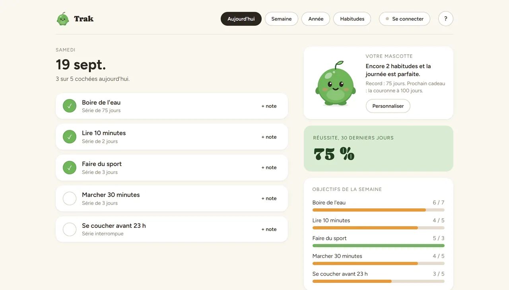

# Trak

Suivi d'habitudes quotidien : un compte, plusieurs appareils, les mêmes données partout.
Fonctionne hors ligne et se resynchronise au retour du réseau. Je l'utilise tous les jours —
c'est d'ailleurs pour ça qu'il existe.

En ligne : https://dunandchatellet.fr/Trak/trak.html
Démo sans compte : https://dunandchatellet.fr/Trak/trak-demo.html

## Ce que ça fait

Quatre vues, dans une seule page :

| Vue | Contenu |
| --- | --- |
| Aujourd'hui | Cocher ses habitudes du jour, série en cours, pourcentage de réussite |
| Semaine | Les sept derniers jours d'un coup d'œil |
| Année | Calendrier de l'année entière, une case par jour |
| Habitudes | Créer, renommer, réordonner, supprimer |

Cinq habitudes sont proposées au départ — eau, lecture, sport, marche, sommeil — et se
remplacent librement.

**Une mascotte** accompagne le suivi : une créature ronde à trois humeurs, qui gagne des
tenues à mesure que le record de série monte (pêche à 3 jours, écharpe à 7, lunettes à 14,
bleuet à 21, chapeau à 30, lavande à 45, doré à 60, couronne à 100, cape à 365). Les tenues
sont gardées par appareil, dans le navigateur : rien ne part sur le serveur.

**Une visite guidée** en huit étapes se lance à la première ouverture, et se rejoue depuis le
bouton « ? » de l'en-tête.

## Comment c'est fait

Front : une seule page HTML (`trak.html`) et `support.js`, sans framework ni dépendance.
Back : PHP **sans base de données** — les données vivent dans des fichiers JSON sous
`api/data/`, avec un verrou global et des écritures atomiques pour qu'une synchronisation
interrompue ne laisse jamais un fichier à moitié écrit.

| Fichier | Rôle |
| --- | --- |
| `trak.html` | L'application entière |
| `trak-demo.html` | Démo sans compte, pour essayer |
| `support.js` | Fonctions d'appui du front |
| `api/auth.php` | Inscription, connexion, jetons |
| `api/store.php` | Lecture et écriture des données |
| `api/sync.php` | Fusion entre appareils |
| `api/_core.php` | Réglages communs, garde-fous, erreurs |

L'architecture du back est détaillée dans [`api/LISEZMOI.md`](api/LISEZMOI.md).

### Sécurité

- L'API **refuse les connexions non chiffrées** (403) : sans ça, un mot de passe tapé sur
  `http://` circulerait en clair. `api/.htaccess` a son propre moteur de réécriture, donc la
  redirection https du site ne s'y applique pas.
- Mot de passe de 8 caractères minimum, jetons valables un an, tentatives de connexion
  limitées.
- Nombre de comptes plafonné (`TRAK_MAX_ACCOUNTS`) : c'est un hébergement mutualisé
  personnel, pas un service ouvert.
- `api/data/` n'est pas versionné : il contient les comptes et les données réelles.

## Honnêteté sur la fabrication

**Ce projet a été codé avec l'aide d'une IA.** Je ne maîtrise ni le PHP ni le JavaScript à ce
niveau-là. Ce qui vient de moi : l'idée et le cahier des charges, les choix de fonctionnement
et de design, les tests, les corrections et la mise en ligne — et je continue de le faire
évoluer. Je préfère le dire que le laisser croire.

## Installation

Déposer `trak.html` et le dossier `api/` côte à côte sur un hébergement PHP 7.4 ou plus
récent, servi en HTTPS. Ouvrir `api/test.php` pour vérifier l'installation, puis le supprimer.
Le dossier `api/data/` est créé tout seul à la première inscription.

Détails dans [`api/LISEZMOI.md`](api/LISEZMOI.md).

---

Pierre Dunand-Chatellet — [tous mes projets](https://dunandchatellet.fr/projets.html)
